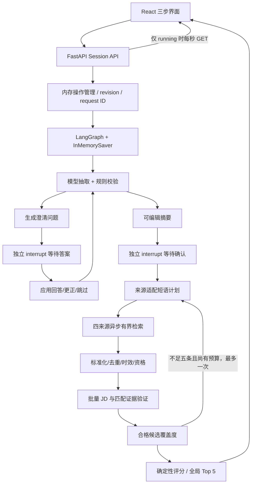

# 交互求职发现架构

规范见 [implementation-plan.md](implementation-plan.md)，请求与状态见 [session-api.md](session-api.md)。

## 边界

- API 校验请求并立即返回 202；操作 task 不依附 HTTP 客户端连接。单会话一个 active operation，幂等 ID 防止重试重复执行，revision 防止旧页面覆盖新状态。
- LangGraph 控制阶段、等待与恢复。模型调用和检索不放在会被重新执行的等待节点中。摘要更正撤销确认，未确认不检索。
- 模型服务是可注入 typed async HTTP provider，先验证 JSON/schema 再由领域代码检查引用、约束和证据。模型不能生成或覆盖系统 ID、URL、时间、薪资、招聘状态及最终分数。
- 检索维持 JobsDB / Zhaopin / Liepin / Shixiseng 与香港/内地区域路由；source outcomes 独立于致命 workflow errors。成功结果不会因另一个来源失败被丢弃。
- 原始来源文档与标准化岗位同时保存。去重后保留各来源正文、excerpt 状态与链接；证据引用只允许指向相应来源文本。
- 评分使用要求覆盖 70%、项目/实习 20%、教育 10%；active 先于 unknown，再按分数与稳定标识排序。已证实过期和硬约束不符被排除，缺失资料不是能力不足的证明。

## 资源与生命周期

每来源默认一页、十条返回、三次详情请求。一次确认的搜索内，所有轮次累计检索最多 60 秒、最多分析 20 个唯一候选；模型批次五条，并发两批；完整搜索 180 秒。补检不改变地点/类型/方向，预算不足如实返回已有可用结果或安全错误。

会话 checkpoint、历史、画像、JD 缓存与操作状态仅存在单进程内存。删除先失效再取消，迟到结果不能复活会话。应用退出取消任务并关闭客户端。浏览器只持久化 session ID，不保存简历、画像或密钥。

`JOBSCOUT_MODE=replay` 显式启用合成演示服务；live 出错不会切换 replay。数据模式必须随结果展示。评估中的 authored replay 也不是真实模型质量证据。

## 可观测性与隐私

日志只包含安全错误码、阶段耗时、来源计数和模型 usage，不记录简历、完整模型请求响应或私有推理。用户提交前获知文本将发送给配置的模型供应商。生产接入是否已验证，以实际测试记录为准，不以架构图替代验收。
