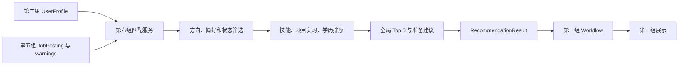

# 第六组：匹配与推荐交付说明

对应 `JobScout_Development_Guide.md` 第六组任务与提交清单，输入、输出严格使用 `src/jobscout/schemas/README.md` 和现有 Schema v1，不新增共享字段。

## 文件与职责

| 文件 | 内容 |
| --- | --- |
| `src/jobscout/services/recommendation_service.py` | 独立推荐入口、规则排序、技能差距和准备建议 |
| `src/jobscout/graph/nodes/recommend.py` | 读取 AgentState、调用服务、返回推荐或统一错误 |
| `tests/test_recommendation_service.py` | 固定数据验收、边界场景、节点与状态 reducer 验证 |
| `data/group6/mock_recommendation_input.json` | 脱敏固定画像与多个方向的标准化岗位 |
| `data/group6/mock_recommendation_result.json` | 对应输入在固定时间下的完整 RecommendationResult |

只修改第六组代码与测试，并新增第六组自己的文档、数据。不修改共享 schemas、其他组服务、前端、Workflow builder、依赖或配置。

## 输入与输出接口

```python
def recommend_jobs(
    profile: UserProfile,
    jobs: Sequence[JobPosting],
    *,
    session_id: str,
    warnings: Sequence[str] = (),
    now: datetime | None = None,
) -> RecommendationResult:
    ...
```

- `profile`：第二组生成的画像。存在 `missing_required_fields`、`conflicts` 或空目标方向时拒绝推荐，由 Workflow 负责在调用前完成确认。
- `jobs`：第五组已经标准化、合并来源并判断状态的岗位；不接受 raw job 或 LLM 原始响应。第五组负责不同 ID 的同一岗位合并。
- `session_id`：非空会话标识，原样保留。
- `warnings`：上游岗位处理等阶段的提示，在结果中保留并按文本去重。
- `now`：可注入的带时区时间；默认当前 UTC，输出统一转换为 UTC。
- 输出：现有 `RecommendationResult`，最多 5 个 `RecommendationItem`，保留原 `JobPosting` 全部字段、来源链接和 `target_direction`。不添加分数或理由字段。结果复制岗位，不修改输入，也不共享可变岗位对象。

画像完整性与字段类型由第二组和共享 schema 负责；本模块不实现画像解析、追问、搜索、岗位标准化或时效重判。

## 筛选与排序 baseline

1. 合并所有方向的候选列表，一次性排序、截取，返回总体 Top 5。方向按 NFKC、大小写和空白归一后与 `target_direction` 比较，不推测新的目标方向，也不为每个方向分配配额。
2. 排除明确 `expired` 的岗位。保留 `unknown` 原状态并提示核实，不能因近期抓取而将其改为 `active`。
3. 应用已确认的地点与工作类型偏好，排除能够明确判断的不符岗位。未知值保留并提示。
4. 所有 `active` 候选先于 `unknown`；同状态下按下述内部总分从高到低排序。
5. 分数相同以原始 `job_id`、`source_url` 升序打破并列；输入换序不会改变唯一 ID 候选的结果。
6. 截取最多 5 条；没有合适岗位时返回空列表和 warning，不填充或伪造岗位。

内部评分只用于排序：

| 因素 | 规则 |
| --- | --- |
| 技能，0–70 | `70 × 已具备的要求技能数 / 去重后的要求技能数` |
| 项目与实习，0–20 | `20 × 在 projects/internships 文本中出现的要求技能数 / 去重后的要求技能数` |
| 学历，0 或 10 | 有明确学历要求且画像中的学历层级达到要求时加 10；没有明确学历要求时不加分 |

空技能要求不视为完全匹配，前两项为 0，返回匹配依据不足提示。评分使用精确分数，避免浮点误差影响并列排序。它是可解释的规则 baseline，不表示录用概率。

技能比较支持 NFKC、大小写、首尾/连续空白归一，及一份保守的别名表：JS/JavaScript、TS/TypeScript、Postgres/PostgreSQL、K8s/Kubernetes、Excel/Microsoft Excel、PowerBI/Power BI、机器学习/Machine Learning。Java 与 JavaScript、C 与 C++/C# 不互相替代。缺失技能保留岗位原始名称，去掉空白和重复项。

`missing_skills` 只依据 `profile.skills`。项目或实习中提及技能可提高相关经验排序，并提醒整理证据，但不会自动把该技能当成已经掌握。项目和实习依据文本关键词，不验证熟练程度或贡献大小。

学历比较支持本科/学士、硕士、博士及其常见英文写法；从 `required_skills` 或含明确要求标记的职责文本读取层级，多个层级按最低层级处理，例如本科或硕士。它不验证学历真实性、是否完成学位、专业、学校、资质或同等经验。此类信息须在来源 JD 中核实。职责中出现经验年限时，生成核实建议，不将项目年数推算为全职工作年数。

重复 `job_id` 是上游质量异常：仅保留第一条并 warning，避免同 ID 占据多个名额；不在推荐层重做公司、职位、地点去重或合并来源。此异常下保留哪条由输入顺序决定，正常输入要求 ID 唯一。

## 偏好与 Schema v1 限制

`confirmed_fields` 按字段路径读取，如 `preferences.location`、`preferences.employment_type`、`preferences.location_unrestricted`；第二组生成时应使用这些完整路径。非空但未确认的偏好不用于硬筛选。

- 地点：已确认具体地点时，在岗位地点文本中匹配同名地点；接受明确地区附加信息，如 `Hong Kong SAR` 或 `上海市`。不做城市别名、地理距离、远程地域资格推断。空或 `unknown` 地点保留并 warning。
- 不限地点：`location_unrestricted=True` 且该字段已确认时不按地点筛选。`location=None`、`location_unrestricted=False` 仍是未知状态，不会被当作用户明确接受不限地点；必要信息确认由第二/三组在搜索前完成。
- 工作类型：Schema v1 没有岗位 `employment_type`，只读取职位名里的明确 internship/intern、full-time、part-time 或中文等价词；也接受职责中的 `Employment type:`、`Job type:`、`工作类型：`、`雇佣类型：` 标签。按实习、兼职、全职顺序识别，不从“与全职同事合作”等职责内容推断岗位类型。无法识别时保留并 warning。
- 已确认薪资、工作模式、行业偏好：岗位缺少可靠的结构化比较条件，返回无法验证的 warning；不从自由文本臆造比较结果。

这套实现不依赖外部模型、API、网络、数据库或环境变量；无需新增依赖。更完整的学历、工作年限、地区和工作类型比较需要团队先确认新增契约或结构化输入，不能在本组私自扩展字段。

## 错误接口

服务抛出 Python `RecommendationError`，其 `.error` 为共享 `WorkflowError`，`stage="recommend"`。它不把 `WorkflowError` 当作 Python exception。

| code | 触发条件 |
| --- | --- |
| `recommendation_invalid_session` | session_id 为空或只有空白 |
| `recommendation_profile_not_ready` | 画像有缺失字段、未解决冲突或没有有效目标方向 |
| `recommendation_invalid_time` | 注入时间没有时区 |
| `recommendation_missing_profile` | 节点没有取得 UserProfile |

示例：

```json
{
  "code": "recommendation_profile_not_ready",
  "message": "画像存在缺失信息或待确认冲突。",
  "stage": "recommend",
  "details": null
}
```

节点将已知服务错误写入 `errors`、清空旧 `recommendation`，并返回 `current_stage="failed"`，让第三组既有错误路由接管。

## Workflow 集成

入口为 `jobscout.graph.nodes.recommend.recommend_node(state)`。从现有 AgentState 读取 `session_id`、`profile`、`normalized_jobs`、`warnings`；成功返回 `recommendation`、`current_stage="recommend"` 和新增 warnings。

`AgentState.warnings` 和 `errors` 使用追加 reducer，因此节点只返回本次新增 warnings，不重复回写上游 warnings；最终 `RecommendationResult.warnings` 包含完整提示。

第三组可以在真实模块替换时，将 recommend 节点接到本入口；节点后继续使用既有 `route_after_recommendation`。本交付保留 `build_mock_graph()` 的原 Mock 接线，避免修改第三组代码。完整端到端 demo 的真实节点接入由第三组负责。

```python
from jobscout.graph.nodes.recommend import recommend_node

# 在第三组维护的图构建代码中替换原 Mock 节点即可：
graph.add_node("recommend", recommend_node)
```

成功节点不直接设置 completed，后续完成节点和 session 生命周期仍由 Workflow 管理。服务及节点都支持空候选结果；若 Workflow 在无岗位时提前结束，需要由第三组决定是否仍调用推荐节点生成空 RecommendationResult。

## Mock 运行与验证

输入 JSON 含 `session_id`、`now`、`profile`、`jobs`、`warnings`，仅是本组离线演示封装，不是新增跨组 schema。7 条标准化岗位含两个方向、active/unknown/expired 状态和不同技能缺口。

在项目根目录运行下面的 Python 示例（保存到本地脚本，或在已激活环境的 Python 中执行）：

```python
import json
from datetime import datetime
from pathlib import Path

from jobscout.schemas.job import JobPosting
from jobscout.schemas.profile import UserProfile
from jobscout.services.recommendation_service import recommend_jobs

example = json.loads(Path("data/group6/mock_recommendation_input.json").read_text(encoding="utf-8"))
result = recommend_jobs(
    UserProfile.model_validate(example["profile"]),
    [JobPosting.model_validate(job) for job in example["jobs"]],
    session_id=example["session_id"],
    now=datetime.fromisoformat(example["now"]),
    warnings=example["warnings"],
)
print(result.model_dump_json(indent=2, ensure_ascii=False))
```

固定样例顺序：`analyst-1`、`analyst-3`、`backend-2`、`analyst-2`、`backend-1`。两个方向共同占用 5 个名额；unknown 候选因已有 5 个 active 候选不入选；expired 被排除；两个来源链接原样保留。完整输出见 `data/group6/mock_recommendation_result.json`，测试会验证它可复现。

```powershell
uv run --locked pytest tests/test_recommendation_service.py
uv run --locked python scripts/check.py
```

测试覆盖总体 Top 5、两个方向、技能排序与别名、学历、项目/实习、经验年限提示、确认/未确认偏好、unknown 与 expired、空输入、重复 ID、稳定并列、输入不变、输出 JSON 校验、统一错误、节点及真实 LangGraph reducer。

## 报告与演示素材

技术摘要：第六组消费第二组的 UserProfile 和第五组的标准化 JobPosting，使用确定性规则筛选与排序，一次性输出总体 Top 5。解释通过缺失技能、相关背景准备建议和数据不确定性提示交付，数字分数只在内部使用。所有输入输出遵守现有 Pydantic Schema v1。

演示步骤：

1. 展示固定画像：Python/SQL、本科学历、相关项目、两个方向、已确认地点和实习偏好。
2. 运行 Mock，展示两个方向共同组成的 5 条推荐，以及来源、链接、职责、要求、技能差距和建议。
3. 展示 expired 岗位被排除；用只有 unknown 候选的测试说明状态保留与申请前核实提示。
4. 用缺失/冲突画像测试展示统一错误；用空候选测试展示空结果及提示。



流程图及固定输出 JSON 可直接用于报告/演示；实际前端截图在第一组接入后生成。
