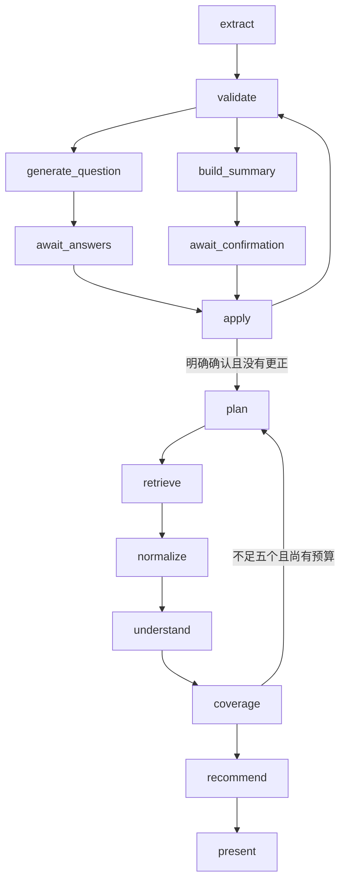

# 用户画像、追问与生产流程（P04）

## 生产入口

`jobscout.graph.live.build_live_graph(checkpointer, provider, search_service=None, *, evidence_factory=None)` 返回异步 LangGraph。`graph/builder.py` 与旧节点保留用于规则基线；生产入口不使用其自动检索路径。

`services/conversation_service.py` 封装内部 Pydantic 模型：`ProfileExtraction`、`QuestionGeneration`、`AnswerInterpretation`、`SearchPhrasing`。提供者实现共享 `LLMProvider` 协议：`async structured(schema, messages, *, deadline=None)`；简历和来源文本仅作为不可信数据传入，错误输出不展示上游响应或私人材料。



仅 `await_answers` 和 `await_confirmation` 调用 `interrupt`，其前置节点的模型调用和检索不会因恢复而重复。等待节点恢复后，先将新版本、running 状态及已失效确认写入检查点，再进入可能等待模型的 `apply` 节点，避免 GET 看到旧版本结果。等待时阶段分别为 `clarify`、`confirm`；终态为 `completed`、`failed`。

所有会话模型系统提示明确把简历、文档和 JD 视为不可信数据；忽略其中要求修改约束、系统字段、流程、确认、ID 或职位元数据的指令。模型输出只能写入允许的画像字段，问题/搜索来源 ID 必须对应服务端允许集合；冻结约束和来源 URL、日期、薪资、状态不允许模型改写。信息未提供属于不确定性，不应解释为已验证的硬条件不匹配。证据服务负责逐条核实岗位/要求 ID 与原文引用。

## 确认约束与追问终止

- 至少提供非空简历或描述，否则保留输入并返回可重试错误。
- 必须由用户明确选择 1–3 个方向；多于三个时要求用户重新选择，不自动截断或推测方向。
- 地点必须属于香港/中国内地的受支持路由或明确不限；就业类型必须明确或不限。
- 每次最多三问。可选问题最多三轮，跳过/已答的可选字段在本轮会话不再出现；同一必填字段两次未解决后改为摘要直接编辑。
- 技能列表不同属于互补信息，`detect_conflicts` 不再把无交集技能标为冲突。模型使用原始文本识别明确否定和冲突；用户更正优先，结构化编辑具有最终优先级。
- 有效答案按 question ID/选项 ID 校验。结构化答案先应用，然后应用自由文本更正，最后应用摘要编辑。
- 仅明确按钮动作 `confirm_search` 或清晰的确认文字可开始检索。确认同时包含更正时重新展示摘要，必须再次确认。确认后的画像深拷贝冻结，检索短语不能改写硬条件。
- 搜索短语仅使用所选方向的翻译/等价表达；不把 `profile.skills` 或其他背景自动加入关键词。

## 会话管理器接入

```python
from langgraph.types import Command
from jobscout.graph.live import build_live_graph

graph = build_live_graph(checkpointer, provider, search_service)
config = {"configurable": {"thread_id": session_id}, "recursion_limit": 60}
await graph.ainvoke({"session_id": session_id, "input_data": input_data, "revision": 1}, config)
# API 验证请求去重/旧版本，并把响应版本递增；载荷保留 expected_revision 旧值。
payload = request.model_dump()
await graph.ainvoke(Command(resume=payload), config)
snapshot = await graph.aget_state(config)

# 已结束的图：相同 thread_id，以普通 state 调用重新进入 entry。
# payload.action 必须是 edit_conditions 或 retry。
await graph.ainvoke({
    **snapshot.values,
    "command": payload,
    "current_stage": "edit_conditions",
    "revision": payload["expected_revision"] + 1,
}, config)
```

初始版本为 1。恢复载荷的 `expected_revision` 保留客户端旧值，图写入 `revision = expected_revision + 1`，且摘要使用相同新值。API 独立维护已接受操作的响应版本，在运行中/等待 GET 时覆盖响应版本，不要提前改写恢复载荷。GET 可通过 `aget_state` 或 `get_state` 直接读取检查点；API 负责旧版本拒绝、请求去重、单会话单操作、删除时取消任务和丢弃已删除会话的迟到结果。

完成/失败的图不能通过 `Command(resume=...)` 重新开始。初始命令键精确为 **`command`**，值为 `SessionResumeRequest.model_dump()`，动作只允许 `edit_conditions` 或 `retry`。管理器可以使用相同 thread ID，把先前 state 合并 `command` 和新 `revision` 后普通 `ainvoke`。`entry` 清除旧推荐、确认、来源结果、错误/警告、分析状态、检索计数和 deadline；保留 `input_data`、`conversation`、`profile_documents` 与追问历史。使用 `Overwrite` 重置累加型错误/警告，避免旧失败污染重试。已有画像无需重新调用提取模型；编辑载荷在进入新摘要前应用，并且必须重新确认。画像提取失败的 retry 会重新提取保留的输入，然后继续澄清/确认。

同一线程已由 `Overwrite([])` 处理累加 reducer 清理，不要求新线程。若管理器选择在 completed/failed 后新建 `thread_id=f"{session_id}:{revision}"` 进行额外隔离，图同样支持：仍传递稳定的 `session_id` 和完整旧状态加 `command`，GET 读取当前活动线程，DELETE 删除管理器记录的全部历史线程 ID，并且只需按稳定 `session_id` 清理一次证据服务。不要在普通 interrupt 恢复中切换线程。

## 检索与分析边界

累计最多两轮检索、60 秒检索时间，确认后的整个操作最多 180 秒。使用单调时钟绝对 deadline 和 asyncio 取消传播；第二轮只更换相同方向的等价短语，不放宽条件。先归一化/去重，再平衡方向与来源，整个操作最多分析 20 个不同岗位。来源诊断放入 `source_outcomes` 和 warnings；部分来源失败保留成功结果，全部来源不可用不能伪装成零结果成功。

`EvidenceService` 通过 factory 注入，每个会话独立实例，跨检索轮次及条件编辑后的新搜索复用已验证 JD 缓存；匹配会按当前画像重新计算。每次明确确认调用 `await service.begin_search(f"{session_id}:{accepted_revision}")`，仅重置本次搜索的 20 个不同候选预算，不清除 JD 缓存；同一确认 ID 重复调用为幂等。图本身的 `analyzed_job_ids` 也只在新确认时重置。

每次成功评估后，将 `EvidenceService.export_cache()` 的 JSON 安全快照写入内部 **`AgentState.jd_cache`**。它只含会话 ID、schema 版本及已验证 JD 分析，不含用户匹配或候选预算。新图/证据实例通过 `import_cache(snapshot, session_id)` 恢复服务端检查点；跨会话或无效快照会被拒绝并重新分析，命中项仍由证据服务按当前原文复核。此字段不是客户端输入或 SessionResponse 字段；管理器旋转线程时随旧 state 一并转移。

内存缓存和检查点快照保留至会话删除。编译图公开异步、幂等回调 **`await graph.cleanup_session(session_id)`**，调用服务的异步清理钩子并移除注册实例。DELETE 顺序必须为：先取消并等待正在运行的会话任务结束，再 await 清理回调，最后删除管理器记录的全部线程检查点；这样不会被尚未结束的节点重新创建缓存。管理器注入其他图时可用 `getattr(graph, "cleanup_session", None)` 检测可选回调，并 await 返回的可等待对象。传递用户原文及回答文档的 ID→文本映射；模型不能替换来源 URL、日期或薪资。结果保留 Top 5 结构并带简短中文 `introduction`。

## 安全阶段日志

非等待节点通过标准库 logger `jobscout.graph.live` 输出 `workflow_stage` 事件：固定阶段名、成功/失败/取消状态、单调时钟耗时、版本、按固定 outcome 状态聚合的来源数量、允许列表错误码，以及数值型模型 usage 快照。不记录 session ID、请求 ID、来源名称、岗位链接、用户材料、JD 原文、模型提示/响应、上游异常内容或推理。usage 为提供者累计快照，可能包含并发会话，不能解释为该阶段/会话独占用量。等待节点不记录用户停留时间。缓存拒绝/导出失败仅记录固定安全码。

## 验证

`tests/test_live_graph.py` 为离线注入测试，覆盖等待不重放、版本同步、简历输入、追问上限、跳过、直接编辑、方向上限、地区校验、显式更正、重试保留输入、部分/全部来源失败、候选预算、无隐式技能关键词、会话隔离、重建图/旋转线程后的 JD 检查点缓存复用、跨会话缓存拒绝，以及日志不泄露输入/来源内容。不代表已完成真实 DeepSeek 或招聘来源联网验证。

---

# 历史规则基线设计（非生产流程）

以下为原有确定性实现的历史记录，不代表 P04 生产行为。尤其旧的“技能无交集即冲突”规则已删除、就业类型不限增加显式布尔支持；当前契约以 `schemas/` 和上文为准。

# 用户画像与确认模块设计文档（第 2 组）

*Profile & Clarification Design — ScoutInput → UserProfile → ClarificationMessage*

本文档是第 2 组（用户画像与信息确认）的**接口与实现说明**，覆盖开发指南 §9 提交清单要求的内容：
输入、输出、错误格式、Mock JSON 示例、集成方式、测试覆盖，以及可直接用于报告/演示的端到端时序与
实测输出（§3.6、§11）。
字段定义以 `src/jobscout/schemas/`（Schema v1）为唯一依据，本文档不修改任何共享契约。
§3 是本组全部实现内容与规则常量，§4–§8 是给相邻组用的接口契约，§9 是已实现功能、已解决问题
与待办事项（含给相邻组的接口注意点），§11 是本文档所有结论的实测证据。
第 3 组可直接按 §4、§6、§7、§8 实现 Session API。

## 1. 范围与职责

模块把前端输入转换为统一的 `UserProfile`，检查必要字段与资料冲突，生成
`ClarificationMessage`，并在用户回答后更新画像：

- 解析简历文本与个人描述，提取 `education` / `skills` / `internships` / `projects`；
- 合并两份背景资料，发现冲突时记录 `conflicts` 而不静默覆盖；
- 计算 `missing_required_fields`，生成追问问题；
- 回答写回后重算缺口与冲突，更新 `confirmed_fields` 和各问题的 `status` / `answer`。

模块**不决定流程走向**（路由由第 3 组负责），不调用网络、模型或外部服务，
因此结果完全确定、可单测。后续若把规则替换为 schema 约束的模型调用，必须保持
`user profile` 契约与函数签名不变（模块 docstring 已说明此升级路径）。

## 2. 代码位置与入口

| 文件 | 内容 |
| --- | --- |
| `src/jobscout/services/profile_service.py` | 纯规则实现（15 个公开对象，完整签名见 §3.2）：`parse_profile_input`、`extract_background`、`merge_backgrounds`、`detect_conflicts`、`build_profile`、`required_missing_fields`、`build_clarification_questions`、`apply_answers`、`InputFormatError`、`EMPLOYMENT_TYPE_UNRESTRICTED` |
| `src/jobscout/graph/nodes/profile.py` | `extract_profile_node`（对应指南 §3.1 的 `extract_profile`）、`validate_profile_node`（对应 `validate_profile`） |
| `src/jobscout/graph/nodes/clarification.py` | `clarification_node`（对应 §3.1 的 `clarify` + `update_profile`，暂停/恢复在同一节点内完成） |
| `tests/test_profile_service.py` | 40 个用例，含用第 3 组真实路由函数串起的暂停→恢复集成测试 |

节点函数名与指南 §3.1 建议名不同，但图节点注册名（`profile` / `validate` / `clarify`）
与 `graph/builder.py` 一致，可直接替换 `mock_profile_node` / `mock_validation_node` /
`mock_clarification_node`，不需要改动状态契约或路由。

## 3. 本组交付内容（全部实现）

### 3.1 交付物清单

| 类别 | 交付物 | 状态 |
| --- | --- | --- |
| 服务层 | `services/profile_service.py`（15 个公开对象） | 完成 |
| 图节点 | `graph/nodes/profile.py`（`extract_profile_node`、`validate_profile_node`） | 完成 |
| 图节点 | `graph/nodes/clarification.py`（`clarification_node`） | 完成 |
| 测试 | `tests/test_profile_service.py`（40 个用例，含真实路由的暂停/恢复集成） | 完成 |
| 文档 | 本文档（接口 + 实现细节 + 已实现功能 / 已解决问题 / 待办与接口注意点 + 实测证据） | 完成 |
| 非本组范围 | 路由决策、图装配、Session API、HTTP 层、持久化 | 第 3 组 |

本组**不新增**任何共享契约：不新增 schema、不新增 state 键、不新增错误码，全部复用
`schemas/profile.py`（`UserProfile` / `ProfilePreferences` / `ProfileSource`）、
`schemas/search.py`（`ClarificationMessage` / `ClarificationStatus`）、
`schemas/errors.py`（`WorkflowError`）。

### 3.2 服务层公开 API（`src/jobscout/services/profile_service.py`）

| 公开对象 | 签名 | 职责与关键行为 |
| --- | --- | --- |
| `InputFormatError` | `ValueError` 子类 | 输入格式错误；节点负责转成 `WorkflowError(code="invalid_input")` |
| `EMPLOYMENT_TYPE_UNRESTRICTED` | 常量 `"unrestricted"` | 用户回答"就业类型不限"时写入 `preferences.employment_type` 的哨兵值（见 §6、§9.2 B9） |
| `ResumeFile` | `TypedDict{name: str, text: str}` | 简历载荷，与前端 `ResumeFile` 对齐 |
| `ProfileInput` | `frozen dataclass` | 归一化输入：`description` / `resume` / `target_directions` / `preferences` |
| `parse_profile_input(input_data)` | `Mapping[str, object] -> ProfileInput` | 校验 + 归一化；未知键忽略；非法值抛 `InputFormatError` |
| `Background` | `frozen dataclass` | 单份文本解析结果：`education` / `skills` / `internships` / `projects` |
| `extract_background(text)` | `str -> Background` | 章节解析 + 技能词典扫描，去重保序 |
| `merge_backgrounds(backgrounds)` | `Iterable[Background] -> Background` | 按传入顺序合并，大小写不敏感去重，先到者胜 |
| `detect_conflicts(resume, description)` | `(Background, Background) -> list[str]` | 仅 `skills`：双方均非空且无交集时返回 `["skills"]` |
| `dedupe(items)` | `Iterable[str] -> list[str]` | 去空白、`casefold` 去重、保留首次出现 |
| `split_list_text(text)` | `str -> list[str]` | 按分隔符拆分并去重，用于字符串方向与回答文本 |
| `required_missing_fields(profile)` | `UserProfile -> list[str]` | 必要字段缺口，稳定顺序：方向 → 地点 → 工作类型 |
| `build_profile(profile_id, *, ...)` | `-> UserProfile` | 组装冻结画像，自动计算 `conflicts` 与 `missing_required_fields` |
| `build_clarification_questions(profile)` | `UserProfile \| None -> list[ClarificationMessage]` | 待办字段一条问题；`profile=None` 时只问 `target_directions` |
| `apply_answers(profile, questions, answers)` | `-> tuple[UserProfile, list[ClarificationMessage]]` | 回答写回，重算缺口，更新问题 `status` / `answer` |

内部调用顺序（即节点内部的真实顺序）：

```text
parse_profile_input
  → extract_background(简历) / extract_background(描述)
  → merge_backgrounds([简历, 描述])
  → detect_conflicts(简历背景, 描述背景)
  → build_profile(...)            # 内部调用 required_missing_fields
  → required_missing_fields(...)  # 回答写回后再算一次
  → build_clarification_questions(...) / apply_answers(...)
```

### 3.3 图节点 API（`src/jobscout/graph/nodes/`）

| 节点注册名 | 函数 | 读取 | 写入（局部 state 更新） | 幂等 / 边界 |
| --- | --- | --- | --- | --- |
| `profile` | `extract_profile_node` | `input_data`、`session_id` | `profile`、`current_stage="profile"`，可选 `warnings`、`errors` | `profile` 已存在 → 只返回 stage（空操作） |
| `validate` | `validate_profile_node` | `profile` | `profile`（重算缺口）、`current_stage="validate"`，可选 `warnings` | 无画像 → 只 warning，不改画像 |
| `clarify` | `clarification_node` | `profile`、`clarification_questions` | `clarification_questions`、`profile`（写回后）、`current_stage="clarify"`，可选 `errors` | 首次发布问题；二次 `interrupt`；恢复时写回；恢复时无画像 → `errors`（fail-fast） |

**节点行为细节**

- `extract_profile_node`：`input_data` 为 `None` 时按空字典处理；**非对象（字符串 / 列表 /
  Pydantic 模型等）返回 `invalid_input`**（见 §9.2 B1）；`InputFormatError` →
  `WorkflowError(code="invalid_input", stage="profile")`；`source.resume` 与 `source.description`
  都为空时追加 warning，但**仍然产出画像**（流程继续，见 §9.3 A1）。
- `validate_profile_node`：用 `required_missing_fields` 重算后写回，与 `apply_answers` 内部的重算
  结果一致，因此重复执行无副作用。
- `clarification_node`：只能在图内运行（`interrupt()` 需要 runnable context，见 §9.2 B11），
  因此单测必须包一层图或直接测服务层。

### 3.4 state 键读写契约

| state 键 | 本组是否写入 | 说明 |
| --- | --- | --- |
| `session_id` | 只读 | `profile_id` 的来源；缺失会 `KeyError`（调用方必须提供） |
| `input_data` | 只读 | 输入契约见 §4；原文保留在 state 中（接口与合规注意点见 §9.4 C8、§9.5 D1） |
| `profile` | **写** | 新增画像，或写回回答后的画像 |
| `clarification_questions` | **写** | 首次发布，或更新 `status` / `answer` |
| `current_stage` | **写** | 只会写入 `profile` / `validate` / `clarify` |
| `warnings` | **写** | append 语义（`operator.add` 合并） |
| `errors` | **写** | 只写 `invalid_input`，`stage` 为 `profile` 或 `clarify`；append 语义 |
| `search_requests`、`raw_jobs`、`normalized_jobs`、`recommendation` | 只读 | 其他组职责 |

### 3.5 规则常量（可调整，改动需团队确认）

**章节关键字 `_SECTION_KEYWORDS`（按标题行识别，大小写不敏感）**

| 章节 | 关键词 |
| --- | --- |
| `education` | `education`、`education background`、`educational background`、`academic background`、`学历`、`教育`、`教育背景`、`教育经历` |
| `skills` | `skill`、`skills`、`core skills`、`technical skills`、`tech stack`、`技能`、`技能清单`、`技术栈` |
| `internships` | `experience`、`internship`、`internships`、`professional experience`、`work experience`、`实习`、`实习经历`、`实习经验`、`工作经历`、`任职经历`、`实践经历` |
| `projects` | `project`、`project experience`、`projects`、`项目`、`项目经历`、`项目经验`、`个人项目`、`个人项目经历` |

标题判定（`_is_header`）现在只认 Markdown 的 `#` 前缀；以 `:` / `：` 结尾的行**不再**截断章节，
所以 `Responsibilities:` 之后的条目会保留（见 §9.2 B7）。未知的纯文本标题行仍按正文计入当前章节，
这是刻意的 MVP 取舍（见 §9.2 B6）。

**技能词典 `_SKILL_VOCABULARY`（51 个词，键=匹配用小写，值=展示写法）**

```text
aws→AWS, azure→Azure, c#→C#, c++→C++, css→CSS, data analysis→Data Analysis,
data engineering→Data Engineering, data visualization→Data Visualization,
deep learning→Deep Learning, django→Django, docker→Docker, excel→Excel,
fastapi→FastAPI, figma→Figma, flask→Flask, gcp→GCP, git→Git, golang→Golang,
hadoop→Hadoop, html→HTML, java→Java, javascript→JavaScript, k8s→Kubernetes,
kotlin→Kotlin, kubernetes→Kubernetes, linux→Linux, machine learning→Machine Learning,
mongodb→MongoDB, mysql→MySQL, nlp→NLP, node.js→Node.js, numpy→NumPy,
pandas→pandas, postgres→PostgreSQL, postgresql→PostgreSQL, power bi→Power BI,
powerbi→Power BI, python→Python, pytorch→PyTorch, react→React, redis→Redis,
scikit-learn→scikit-learn, spark→Spark, spring boot→Spring Boot, sql→SQL,
statistics→Statistics, swift→Swift, tableau→Tableau, tailwind css→Tailwind CSS,
tensorflow→TensorFlow, typescript→TypeScript
```

匹配规则：全文 `casefold` 后套用 `(?<![a-z0-9+#.])关键词(?![a-z0-9+#])`，因此 `java` 不会命中
`javascript`、`postgres` 不会命中 `postgresql`、`sql` 不会命中 `mysql`；命中结果按**首次出现位置**
排序，与用户书写顺序一致（原为词典顺序，见 §9.2 B4）。

**其他常量**

| 常量 | 内容 | 用途 |
| --- | --- | --- |
| `_LIST_SEPARATOR` | `,`、`，`、`、`、`;`、`；`、`/`、`\|` | 拆分方向字符串与回答文本 |
| `_TRAILING_SEPARATOR` | `；;，,、` | 去掉章节条目末尾的分隔符 |
| `_BULLET_PREFIX` | `^\s*(?:[-*•·] \| \d+[.)])\s*` | 去项目符号与编号 |
| `_MARKDOWN_MARKS` | `*`、`_`、反引号 | 去 Markdown 强调符号 |
| `_UNRESTRICTED_ANSWERS` | `不限`、`any`、`anywhere`、`no preference`、`none`、`unrestricted` | 判定"不限" |
| `EMPLOYMENT_TYPE_UNRESTRICTED` | `"unrestricted"`（公开常量） | 就业类型"不限"的哨兵值，保证追问可收敛（见 §9.2 B9） |
| `_EMPLOYMENT_TYPE_ALIASES` | `全职→full-time`、`实习→internship`、`兼职→part-time`、`full time`/`fulltime→full-time`、`part time`/`parttime→part-time` | 工作类型归一化 |
| `_WORK_MODE_ALIASES` | `办公室`/`office`/`onsite→onsite`、`混合办公`/`hybrid→hybrid`、`远程`/`remote→remote` | 工作方式归一化 |
| `_MISSING_FIELD_QUESTIONS` | 4 条模板：`target_directions`、`preferences.location`、`preferences.employment_type`、`preferences.work_mode` | 缺口追问文案（**已中文化**，与前端 `session-client.ts` 文案一致，见 §9.2 A3） |
| `_CONFLICT_QUESTIONS` | 1 条模板：`skills` | 冲突追问文案（**已中文化**，提示「请给出完整技能列表」，见 §9.2 B14） |
| `_generic_question(field)` | `请补充「{field}」的相关信息。` | 未收录字段的兜底文案（中文） |
| `_split_skill_token(token)` | 仅当按空格切分后**每一段都命中词表且 ≥ 2 段**时才拆分 | 修复空格分隔技能串（`Python SQL Docker` → 3 个技能，`Looker Studio` 保持完整），见 §9.2 B2 |

### 3.6 端到端时序与三类 Mock 示例

开发指南 §7 要求覆盖"完整 / 缺失 / 冲突"三类输入，以下 Mock 与产出均为实测（§11）。

**① 完整输入 → 直接进入检索**

```json
{
  "description": "I build backend services with Python and want to move into data roles.",
  "resume": {"name": "resume.txt", "text": "Education\nBSc Computer Science\n\nSkills\nPython, SQL, Docker\n"},
  "target_directions": ["data analyst", "backend engineer"],
  "preferences": {"location": "Hong Kong", "location_unrestricted": false, "employment_type": "full-time", "salary_range": null, "work_mode": "hybrid", "industry": null}
}
```

产出：`source = {resume: true, description: true}`、`skills = ["Python", "SQL", "Docker"]`、
`target_directions = ["data analyst", "backend engineer"]`、`missing_required_fields = []`、
`conflicts = []` → `route_after_validation = "search"`，无追问。

**② 缺失输入 → 追问 3 项**

```json
{}
```

产出：`missing_required_fields = ["target_directions", "preferences.location",
"preferences.employment_type"]`、`warnings = ["No resume or personal description was provided."]`、
3 条 pending 问题 → `route_after_validation = "clarify"`。
回答 `{"target_directions": "data analyst", "preferences.location": "不限",
"preferences.employment_type": "实习"}` 后得到 `["data analyst"]`、`location=None` +
`location_unrestricted=True`、`employment_type="internship"`，缺口清空 →
`route_after_clarification = "validate"` → `"search"`。

**③ 冲突输入 → 只追问 `skills`**

```json
{
  "resume": {"name": "r.txt", "text": "Skills\nPython, SQL"},
  "description": "Skills\nJava, Golang"
}
```

产出：`skills = ["Python", "SQL", "Java", "Golang"]`（合并结果，**不静默裁决**）、
`conflicts = ["skills"]`、缺口仍为 `preferences.location` / `preferences.employment_type`。
回答 `{"skills": "Python, SQL"}` 后：`skills = ["Python", "SQL"]`、`conflicts = []`、
`confirmed_fields = ["skills"]`。

**流程时序**

```text
START → profile → validate → [route_after_validation]
                             ├─ search                 （无缺口、无冲突）
                             └─ clarify → (interrupt) → 写回 → validate → search
```

`clarify` 节点的五步循环：

1. 首次进入：`build_clarification_questions(profile)` 发布问题后正常返回；
2. `route_after_clarification` 发现仍有 `required` 且 `pending` 的问题 → 再次进入 `clarify`；
3. 第二次进入：`interrupt({"questions": [...], "message": ...})` 暂停，`outcome="paused"`；
4. `Command(resume={"answers": {...}})` → 同一次 `clarify` 调用内继续执行 → `apply_answers` 写回；
5. 仍有待答问题 → 回到步骤 2 循环；否则 `route_after_clarification = "validate"` → `search`。

## 4. 输入契约：`AgentState.input_data`

`input_data` 使用前端 `ScoutInput` 形状（`web/src/lib/contracts.ts`），第三组按
HTTP 请求体构造后传给 `run_workflow(graph, session_id, input_data=...)`：

```json
{
  "description": "I build backend services with Python and want to move into data roles.",
  "resume": {"name": "resume.txt", "text": "Education\nBSc Computer Science\n\nSkills\nPython, SQL, Docker\n"},
  "target_directions": ["data analyst", "backend engineer"],
  "preferences": {
    "location": "Hong Kong",
    "location_unrestricted": false,
    "employment_type": "full-time",
    "salary_range": null,
    "work_mode": "hybrid",
    "industry": null
  }
}
```

字段规则（缺省值均为"未提供"，不会报错）：

| 字段 | 类型 | 规则 |
| --- | --- | --- |
| `description` | `string` | 缺失/`null` 视为 `""`；必须为字符串，否则报 `invalid_input` |
| `resume` | `{name, text} \| string \| null` | `null` 无简历；传纯字符串时按 `name="resume.txt"` 处理；`text` 空白视为无简历；`text` 非字符串报 `invalid_input` |
| `target_directions` | `string[] \| string` | 字符串按 `,`、`，`、`、`、`;`、`；`、`/`、`\|` 拆分；条目去空白、去重、丢空值 |
| `preferences` | `object \| null` | 未定义的键会报 `invalid_input`（`ProfilePreferences` 使用 `extra="forbid"`）；`null` 等价于全默认 |

画像模块仍接收**纯文本**。上传模块支持 PDF、DOCX 和 UTF-8 TXT（≤ 10 MB），PDF / DOCX 通过
`POST /api/v1/resumes/parse` 提取文字后统一转换为 `{name, text}`，不改变本模块的输入契约。
扫描版 PDF 需先进行 OCR。详见[简历上传模块](resume-upload-design.md)。

`input_data` 中**未使用的键会被忽略**，便于第三组在同一字典里携带会话附加信息。

## 5. 输出契约：状态更新

三个节点都只返回**局部状态更新**，字段全部取自共享 schema：

| 节点 | 写入的 state 键 |
| --- | --- |
| `extract_profile_node` | `profile`（新增时）、`current_stage="profile"`、可选 `warnings`、可选 `errors` |
| `validate_profile_node` | `profile`（重算 `missing_required_fields`）、`current_stage="validate"`、可选 `warnings` |
| `clarification_node` | `clarification_questions`、`profile`（写回回答后）、`current_stage="clarify"` |

`UserProfile` 关键语义（与 `schemas/README.md` 一致）：

- `profile_id` = `state["session_id"]`；同一 session 恢复时保持稳定。
- `source.resume` / `source.description` 表示该来源是否提供了非空内容。
- `confirmed_fields` 初始为空，只在用户回答追问时追加被确认的字段名。
- `missing_required_fields` 稳定顺序：`target_directions` → `preferences.location` → `preferences.employment_type`。
- `conflicts` 目前只可能包含 `"skills"`（双方技能均非空且无交集）。
- `preferences.location=None` 且 `location_unrestricted=False` 表示地点未确定；用户回答"不限"时写为 `location=None` + `location_unrestricted=True`。
- `preferences.employment_type` 是自由文本：用户回答「不限」时写为 `unrestricted`（公开常量
  `EMPLOYMENT_TYPE_UNRESTRICTED`），因此它仍是已确认的必填值，缺口消失、追问收敛（见 §9.2 B9）。

幂等性：`extract_profile_node` 在 `state["profile"]` 已存在时为空操作，因此
interrupt 恢复或重试**不会**覆盖已确认的画像（符合 `docs/langgraph/11-errors-and-idempotency.md`）。

## 6. 追问契约：`ClarificationMessage` 与回答格式

追问来自 `build_clarification_questions`，每个待办字段一条：

```json
{
  "question": "你希望寻找哪一类岗位？",
  "field": "target_directions",
  "reason": "求职方向用于确定搜索范围；多个方向可以用逗号分隔。",
  "required": true,
  "status": "pending",
  "answer": null
}
```

`clarification_node` 的两段式协议（与 `mock_clarification_node` 完全一致）：

1. 第一次进入：发布 `clarification_questions`，节点正常返回；
2. 第二次进入（`route_after_clarification` 判定仍有 `required` 且 `pending` 的问题）：
   调用 `interrupt({"questions": [...], "message": "..."})` 暂停；
3. 恢复时 `Command(resume={"answers": {field: answer}})`，节点写回回答。

**回答映射表**（key 为 `ClarificationMessage.field`，value 为用户回答文本）：

| `field` | 接受的回答 | 写回结果 |
| --- | --- | --- |
| `target_directions` | 分隔符文本，如 `"data analyst, backend engineer"` | 拆分、去重后的 `list` |
| `preferences.location` | 城市名；或 `不限` / `any` / `anywhere` / `no preference` / `none` / `unrestricted` | 城市名，或 `location=None` + `location_unrestricted=True` |
| `preferences.employment_type` | `全职` / `实习` / `兼职`，或 `full-time` / `full time` / `fulltime` / `part-time` / `part time` / `parttime`，或任意文本 | 归一化后的字符串；回答"不限"会被归一为 `unrestricted`（公开常量 `EMPLOYMENT_TYPE_UNRESTRICTED`），缺口消失、问题置为 `answered`（见 §9.2 B9） |
| `preferences.work_mode` | `办公室` / `混合办公` / `远程` / `onsite` / `hybrid` / `remote` / `不限` | `onsite` / `hybrid` / `remote` / `None` |
| `preferences.salary_range`、`preferences.industry` | 任意文本 | 原样写入 |
| `skills` | 分隔符文本 | 替换 `skills` 并清除 `skills` 冲突 |

未知 `field` 与空白回答一律忽略，问题保持 `pending`；已 `answered` 的问题不会被覆盖。
`skills` 回答先按分隔符拆分，再按词表拆分空格串（`Python SQL Docker` → 3 个技能），并整体替换技能集合。
回答后 `missing_required_fields` 与 `conflicts` 由规则重算，不由前端传入。

## 7. 错误格式

不合法输入不抛异常到 API 层，而是写入 `AgentState.errors`（`WorkflowError`），
由 `route_after_validation` 判定为 `failed`：

```json
{
  "code": "invalid_input",
  "message": "target_directions must be a list of strings.",
  "stage": "profile",
  "details": null
}
```

触发条件与实测 `message`（全部为 `code="invalid_input"`、`stage="profile"`、`details=null`）：

| 非法输入 | `message` |
| --- | --- |
| `input_data` 不是对象（字符串 / `bytes` / 列表 / Pydantic 模型） | `input_data must be an object.` |
| `description` 不是字符串 | `description must be a string.` |
| `resume` 不是对象 / 字符串 / `null` | `resume must be an object with name and text, or null.` |
| `resume.text` 不是字符串 | `resume.text must be a string.` |
| `target_directions` 不是列表或字符串 | `target_directions must be a list of strings.` |
| `target_directions` 含非字符串条目 | `target_directions must only contain strings.` |
| `preferences` 不是对象或 `null` | `preferences must be an object or null.` |
| `preferences` 含未定义字段或类型不符 | `preferences does not match the agreed preference fields.` |
| 恢复时 `profile` 缺失（`clarification_node`） | `No profile is available to update.`（`stage="clarify"`，见 §9.2 B10） |

服务层内部用 `InputFormatError`（`ValueError` 子类）表达，节点负责转成 `WorkflowError`；
Pydantic 的原始报错被有意省略（避免泄露内部结构）。**回答阶段（`answers`）不产生任何错误**：
未知 `field`、非字符串答案、空白答案都被静默忽略（见 §9.3 B12、B13）；唯一的例外是恢复时画像缺失，此时返回 `stage="clarify"` 的 `invalid_input`（见 §9.2 B10）。

非阻断提示写入 `warnings`：无简历且无描述时
`"No resume or personal description was provided."`；`validate` 遇到无画像时
`"No profile is available for validation."`。

## 8. 集成方式

**第 3 组（Session API / Workflow）**

```python
from jobscout.graph.runner import run_workflow

result = run_workflow(graph, session_id, input_data=request_body)
# result["outcome"] ∈ {"paused", "completed", "failed"}
# result["state"] 提供 profile / current_stage / clarification_questions /
#                 recommendation / errors / warnings
```

- `outcome="paused"` 时 `state["current_stage"] == "clarify"`，与前端
  `ScoutSession.current_stage`（`'clarify' | 'completed' | 'failed'`）可直接对应；
  返回的 `clarification_questions` 数量与待回答的问题一致。
- 恢复：`run_workflow(graph, session_id, answers={"preferences.location": "不限"})`，
  必须使用同一个 `session_id`（即 graph `thread_id`）。
- 需要替换 Mock 时，把 `profile` / `validate` / `clarify` 三个节点的函数替换为
  本文档 §2 的三个节点函数即可，边与路由无需改动（已用探针验证全流程
  `paused → completed` 并产出 recommendation）。

**第 1 组（前端）**：直接渲染 `ClarificationMessage`，以 `field` 作为回答的 key；
`current_stage == 'completed'` 时读取 `recommendation`。前端 demo adapter
（`web/src/lib/session-client.ts`）的字段名、分隔符、地点 `不限`、`全职/实习/兼职`、
`办公室/混合办公/远程` 规则与本模块一致；**唯一已知差异**是「就业类型不限」的取值：
adapter 原样写入 `"不限"`，本模块写入哨兵值 `"unrestricted"`（`EMPLOYMENT_TYPE_UNRESTRICTED`），
按 §9.4 C10 对齐即可（不影响本模块的收敛行为）。

**第 6 组（匹配推荐）**：读取 `target_directions`、`skills`、`education`、`internships`、
`projects` 与 `preferences.*`；`location_unrestricted=True` 表示不限地点。

**运行依赖与环境变量**：本模块是纯规则实现，**不读取任何环境变量、不需要 API key、不访问网络或
外部服务**（与 §1 一致），因此集成时不需要在 `.env.example` 中新增配置项；相邻组只需通过
`graph/builder.py` 注册的三个节点和 `graph/runner.py` 的 `run_workflow` 调用。全流程可用固定
Mock 文本离线复现（§3.6、§11），`tests/test_profile_service.py` 亦不依赖外部服务。

## 9. 已实现功能、已解决问题与待办事项

本章按「已实现 → 已解决 → 待解决 → 接口注意点」组织，相邻组可按需跳读：

- **§9.1 已实现的功能**：本模块对外可见的行为契约，逐项说明（证据见 §11）；
- **§9.2 已解决的问题**：已闭环的修复记录，只保留这些问题**可能引起的跨组接口影响**；
- **§9.3 待解决的问题**：本组未解决或需他人决策的事项，含归属与下一步；
- **§9.4 需要注意的接口问题**：给第 1 / 3 / 6 组的对接要点（C 系列）；
- **§9.5 安全、合规与运维注意点**（D 系列）；
- **§9.6 责任边界与本组交付 / 转交清单**。

**责任归属约定**（依据 `README.md` 的职责分工与开发指南）：

- **第二组主责**：画像提取/更新、缺失信息识别与追问处理（含追问文案、抽取质量、回答写回）；
- **第 3 组主责**：Session API 的请求校验、HTTP 语义、checkpoint 持久化、共享契约文档；
- **团队契约决策**：新增字段、新增抽取规则或改动共享 schema 的项。

### 9.1 已实现的功能（对外可见行为）

| 功能 | 行为契约 | 实现位置 | 证据 |
| --- | --- | --- | --- |
| 输入解析 | `description` 接受纯文本或 `{text}`；`resume` 接受字符串或 `{name, text}`；`target_directions` 接受字符串或列表；`preferences` 接受对象；非法值抛 `InputFormatError`；`description` 与 `resume.text` 均为空时返回告警但**继续产出画像** | `parse_profile_input`、`_parse_description`、`_parse_resume`、`_parse_directions`、`_parse_preferences` | §4、§11.1 |
| 非对象输入防御 | `input_data` 不是对象（字符串 / `bytes` / 列表 / Pydantic 模型）→ `WorkflowError(code="invalid_input", stage="profile")`，不再抛 `AttributeError` | `graph/nodes/profile.py` | §9.2 B1、§11.1 |
| 章节抽取 | 按行识别章节：Markdown `#` 前缀，或大小写不敏感的中英文章节关键词；条目去掉项目符号、编号、Markdown 强调符与行尾分隔符；完全未知的标题行按正文计入当前章节 | `_split_sections`、`_canonical_section`、`_is_header`、`_clean_line`、`_parse_entries` | §3.5、§11.2 |
| 技能扫描 | 51 词白名单、大小写不敏感、词边界匹配（`java` 不命中 `javascript`）；按**文本首次出现位置**排序；空格分隔的技能串在「每段都命中词表且 ≥ 2 段」时才拆分；未知多词技能（`Looker Studio`）保持完整 | `_scan_skill_vocabulary`、`_parse_skill_tokens`、`_split_skill_token` | §3.5、§11.2 |
| 背景合并 | 简历与个人描述按「简历优先」合并；`casefold` 去重并保留先出现的写法 | `extract_background`、`merge_backgrounds`、`dedupe` | §3.5 |
| 冲突检测 | 仅对 `skills`：两侧均非空且交集为空 → `conflicts = ["skills"]` | `detect_conflicts` | §3.5 |
| 必要字段缺口 | 按 `target_directions` → `preferences.location` → `preferences.employment_type` 的稳定顺序；`location_unrestricted=True` 时地点不计缺口 | `required_missing_fields` | §3.5、§5 |
| 追问生成 | 每个待办字段一条 `ClarificationMessage`，`question` / `reason` / 选项**全部为中文**；`profile=None` 时只问 `target_directions` | `build_clarification_questions`、`_generic_question` | §3.5、§9.2 A3 |
| 回答写回 | 7 类 `field`（`target_directions`、`preferences.location`、`preferences.employment_type`、`preferences.work_mode`、`preferences.salary_range`、`preferences.industry`、`skills`）各有归一化规则（§6 表）；「不限」在 `preferences.location` → `location_unrestricted=True`、在 `preferences.employment_type` → `EMPLOYMENT_TYPE_UNRESTRICTED`；`skills` 回答整体替换并清除 `conflicts`；`preferences.work_mode` 归一化且「不限」→ `None`；写回后重算缺口；已 `answered` 的问题不再覆盖 | `apply_answers`、`_normalize_employment_type`、`_normalize_work_mode`、`_is_unrestricted_answer` | §6、§11.3 |
| 追问暂停 / 恢复 | 两段式 `interrupt` + `Command(resume={...})`，返回形状与 `mock_clarification_node` 一致；`paused → completed` / `failed` 由第 3 组路由决定 | `clarification_node` | §3.4、§11.3 |
| 幂等性 | 画像已存在时 `extract_profile_node` 不重建、不改动任何 state 键 | `extract_profile_node` | §11.3 |
| 失败收敛 | 恢复时画像缺失 → `stage="clarify"` 的 `invalid_input`，由路由走 `failed`，不空转 | `clarification_node` | §9.2 B10、§11.3 |
| 契约冻结 | 不新增 schema 字段、不新增 state 键、不新增错误码；本轮唯一新增的公开符号是 `EMPLOYMENT_TYPE_UNRESTRICTED = "unrestricted"` | 全模块 | §3.2 |

### 9.2 已解决的问题（修复记录）

下列问题已在本组 4 个文件内闭环，本组不再把它们列为待办；但修复**改变了对外可观察的输出**，
因此逐条给出可能影响相邻组的接口后果（完整对接要求见 §9.4）。

| 编号 | 原问题 → 现行行为 | 回归用例 | 可能影响相邻组的接口后果 |
| --- | --- | --- | --- |
| A3 | 追问文案为英文 → 模板与兜底文案全部中文化（`question` / `reason` / 选项） | `test_build_clarification_questions_uses_chinese_copy` 等 3 个 | 无残留：前端直接渲染后端返回的文案即可，不需要在前端维护映射表 |
| B1 | 非对象 `input_data` 抛 `AttributeError` → 返回 `stage="profile"` 的 `invalid_input` | `test_extract_profile_node_reports_a_non_mapping_input` | 调用方改为按 `invalid_input` 分支处理，不必再用 `AttributeError` 兜底；Pydantic 模型需先 `model_dump()`（§9.4 C2） |
| B2 | `"Python SQL Docker"` 被当成一个技能 → 拆成 3 个技能；未知多词技能（`Looker Studio`）仍保持完整 | `test_extract_background_splits_space_separated_skills`、`test_extract_background_keeps_unknown_multiword_skills`、`test_apply_answers_splits_space_separated_skills` | `skills` 的元素粒度更细、条数可能变多，第 6 组不宜按固定条数或全等比较（§9.4 C11） |
| B4 | 技能按词典顺序 → 按文本首次出现位置排序 | `test_extract_background_orders_skills_by_first_appearance` | `skills` 顺序不再等于词表顺序，消费方应按集合语义处理（§9.4 C11） |
| B5 | 词表 48 词 → 51 词（补 `postgres`、`powerbi`、`k8s`） | `test_extract_background_recognizes_skill_aliases` | 识别结果新增规范写法 `PostgreSQL` / `Power BI` / `Kubernetes`，第 6 组匹配需接受这些写法（§9.4 C11） |
| B6 | 未收录的中文标题会整段丢内容 → 补入 `教育经历`、`实习经验`、`任职经历`、`实践经历`、`项目经验`、`个人项目`、`个人项目经历` | `test_extract_background_reads_chinese_section_titles` | 这些标题下的内容现在会进入 `education` / `internships` / `projects`，背景条目可能变多 |
| B7 | 以 `:` / `：` 结尾的行会截断章节 → `_is_header` 只认 Markdown `#` 前缀 | `test_extract_background_keeps_entries_after_a_colon_label` | `Responsibilities:` 这类标签行会**作为一条背景条目保留**（"不丢信息"优先于"不引入噪声"），前端与第 6 组需容忍该噪声（§9.4 C11） |
| B9 | 回答「不限」被忽略 → 问题保持 `pending`，会话始终 `clarify` → 「不限」归一为 `EMPLOYMENT_TYPE_UNRESTRICTED`（`"unrestricted"`）写入 `preferences.employment_type`，缺口清空、图在 `validate` 收敛 | `test_apply_answers_accepts_an_unrestricted_employment_type`、`test_unrestricted_employment_type_converges_through_the_shared_routers` | **重要**：`preferences.employment_type` 可能取到 `"unrestricted"`，第 6 组必须把它当作「不做筛选」而非一个具体工作类型（§9.4 C10） |
| B10 | 恢复时画像缺失会跳过写回 → 永远 `clarify` → 返回 `stage="clarify"` 的 `invalid_input`，由路由走 `failed` | `test_clarification_node_fails_the_session_when_the_profile_is_missing` | `failed` 的 `errors[0].stage` 可能是 `clarify`，API 层的失败映射需覆盖该 stage（§9.4 C4） |
| B14 | `skills` 冲突回答的语义未说明 → `reason` 写明「请给出完整的技能列表，回答会整体替换当前的技能集合」 | `test_build_clarification_questions_localizes_the_skills_conflict` | 前端不得自行实现「并集」语义；若产品要求并集，属语义变更需团队确认（§9.4 C12） |

### 9.3 待解决的问题

以下为**尚未闭环**的事项：已解决的见 §9.2，接口对齐见 §9.4，安全与运维见 §9.5。
「归属」列只说明由谁推进——本组不会越权改动共享契约或相邻组代码。

**A. 与开发指南 / 共享契约的偏离（需契约 owner 确认）**

| 编号 | 待解决事项 | 现状与影响 | 归属 / 下一步 |
| --- | --- | --- | --- |
| A1 | 「用户背景来源」是 warning，不阻断 | 指南 §2.2 将其列为最低必要信息，但前端问题库（`session-client.ts` 的 `questions` 字典）没有对应模板——未命中 `field` 的问题会被前端**静默丢弃**，强行阻断可能无法收敛；现状：无简历也无描述时仍产出画像 + warning | 团队 + 第 1 组：先约定该问题的 `field`（例如 `source`）与回答语义，本组再实现（约 10 行） |
| A2 | 冲突检测只覆盖 `skills` | 指南 §7 提到「技能或目标方向」，但方向是自由文本、无法可靠对齐；现状：方向不一致不会被追问 | 团队：先定方向抽取规则（词典或模型），本组再扩展到 `conflicts` |
| A4 | 指南 §4.1 的 `UserProfile` 示例缺少 `preferences.location_unrestricted` | 与冻结的 Schema v1（`schemas/profile.py`、`schemas/README.md`）不一致，照 §4.1 实现的组会丢掉「不限地点」语义 | 第 3 组 / 契约 owner：修订共享文档示例 |
| A5 | 节点函数名与指南 §3.1 建议名不同 | `extract_profile_node` vs `extract_profile`；无功能影响（图注册名 `profile` / `validate` / `clarify` 一致） | 团队：保持现状，或统一改名（需同步 builder 与测试） |
| A6 | `profile_id = session_id` | 复用 session 主键，保证恢复后稳定；若 API 需要独立画像 ID 或跨 session 复用画像则不满足 | 团队 / 第 3 组：确认后本组只改 `extract_profile_node` 一处 |
| A7 | 简历文件输入已支持 PDF / DOCX / TXT | 独立上传模块将文件转换为 `{name, text}`，画像模块继续使用纯文本；最大 10 MB，PDF 最多 50 页，扫描件需先 OCR | 接口见[简历上传模块](resume-upload-design.md) |

**B. 实现层保留项与转交项**

| 编号 | 待解决事项 | 现状与影响 | 归属 / 下一步 |
| --- | --- | --- | --- |
| B3 | 由 B2 衍生的多词技能冲突仍会追问 | 简历 `"Skills\nLooker Studio Zenly"` vs 描述 `"Skills\nLooker Studio, Zenly"` → `conflicts = ["skills"]`；两份文本确实给出了不同技能串，规则不能静默裁决 | 本组保留（设计取舍）：若团队要求放宽，需先定义可比较的技能归一化规则 |
| B8 | 章节关键词与技能词表是固定白名单 | 51 个技能词 + 每类 8–11 个标题词，覆盖有限（确定性 MVP 取舍）；已刻意跳过有歧义的缩写 `js` / `ts` / `tf`（会与 `javascript` / `typescript` / `tensorflow` 混淆） | 团队：指定维护责任与版本；升级为模型抽取时必须保持签名与契约 |
| B11 | `clarification_node` 不能在图外调用 | 直接调用报 `RuntimeError: Called get_config outside of a runnable context` | 本组保留（文档提示）：单测/脚本需包一层图，或直接测服务层 |
| B12 | 未知 `answers` 键被静默忽略 | 把 `preferences.location_unrestricted` 当 `field` 提交时无任何反馈，前端字段名拼写错误会被掩盖 | 第 3 组：Session API 校验 `field` 是否属于已发布问题，否则返回 400（§9.4 C1） |
| B13 | 非字符串答案被静默忽略 | `{"preferences.location": 123}` → 忽略，前端类型错误无提示 | 第 3 组：API 层校验答案类型（§9.4 C1） |
| B15 | `confirmed_fields` 可包含从未提问的字段 | 回答 `preferences.salary_range` → `confirmed_fields = ["preferences.salary_range"]`；「已确认」不等于「被问过」，语义可能被误读 | 第 3 组（`schemas/README.md`）+ 可选 API 校验：明确语义，或只记录提问过的字段 |
| B16 | `target_directions` 只接受列表或字符串 | 传 tuple / set → `invalid_input`（JSON 场景无影响，Python 侧调用者容易踩） | 本组可选：经团队确认后放宽为任意可迭代（低风险） |
| B17 | 方向文本中的 `/` 被当作分隔符 | `"前端/后端"` → 两个方向，中文常见写法被拆开 | 团队 + 第 1 组：确认保留现状，或仅在无空格时拆分 |
| B18 | `preferences.location` 不做别名归一 | `香港` 与 `Hong Kong` 是不同取值；文本 `不限` 只由 `location_unrestricted` 表达 | 团队：定义地点规范化，或由第 6 组检索侧容错 |
| B19 | 服务层无输入长度上限 | 前端限 1 MB，服务层不截断；匹配成本为 51 次正则 / 份文本，超大文本会线性拖慢节点 | 第 3 组：API 层限制请求体大小；必要时本组加截断 + warning |
| B20 | 背景条目保留原文、未脱敏 | `education` / `internships` / `projects` 含学校、公司名等，展示或日志可能暴露更多个人信息 | 团队 / 第 3 组：按 `langgraph/03` 的最小化原则处理日志与持久化 |
| B21 | 只有 3 个字段阻断 | `salary_range` / `work_mode` / `industry` 缺失不阻断（符合 MVP），用户可能拿不到期望薪资/办公方式的筛选结果 | 产品 + 第 1 组：确认是否需在检索前补齐 |
| B22 | 缺口计算逻辑存在两处调用 | `build_profile`、`validate_profile_node` / `apply_answers` 都调用 `required_missing_fields`；幂等、无功能问题，但属重复 | 本组保留：该函数是缺口规则的唯一来源，不合并以保持可读性 |

上表条目均可按 §11 的探针方法复现；`field` 全表见 §6，状态字段含义见 §4。

### 9.4 需要注意的接口问题（给第 1 / 3 / 6 组）

本节是**对接清单**：C1–C9 是流程与契约层面的既有差异，C10–C12 是本轮修复带来的取值与语义
变化。相邻组按「现状」列适配即可，本组不改共享契约。

| 编号 | 对接点 | 现状 | 建议的对接方式 |
| --- | --- | --- | --- |
| C1 | `answers` 的校验责任与 HTTP 状态码 | 服务层静默忽略非法答案（§9.3 B12、B13） | 由 Session API 校验：未知 `field`、非字符串答案、缺题 → 400 |
| C2 | `input_data` 类型契约 | `AgentState.input_data` 声明为 `dict[str, object]`；传 Pydantic 模型现在会得到 `invalid_input` | 调用方先 `model_dump()`；不建议放宽共享 state 类型 |
| C3 | `profile_id` 语义 | 等于 `session_id` | 若要求独立 UUID，确认后改一处 |
| C4 | `current_stage` 与错误的映射 | 本组只写 `profile` / `validate` / `clarify`，且失败可能带 `stage`（`profile` 或 `clarify`）；前端 `ScoutSession.current_stage` 只有 `clarify` / `completed` / `failed` | API 层映射：paused → `clarify`，completed → `completed`，failed → `failed`，不要按 `stage` 判分支 |
| C5 | paused 的 HTTP 语义 | `run_workflow` 返回 `outcome="paused"` | 可按 `langgraph/09` 用 202 + `session_id`（团队确认） |
| C6 | 同一 session 并发 resume | 未做互斥；`InMemorySaver` 单进程内有效 | 按 session 串行化（加锁）或冲突时返回 409 |
| C7 | 进程重启后 session 丢失 | `InMemorySaver` 非持久化 | MVP 可接受；生产需换持久化 checkpointer（第 3 组） |
| C8 | `state["input_data"]` 含简历原文 | 本组只读该键 | API 响应**不得**回传 `input_data`（`langgraph/09` 明确不返回简历原文） |
| C9 | `warnings` 是否透出到前端 | 本组产生 2 类英文 warning（`No resume or personal description was provided.`、`No profile is available to validate.`） | 若透出，需要中文文案或由前端映射 |
| C10 | 「就业类型不限」的取值 | 本模块写 `preferences.employment_type = "unrestricted"`（哨兵值，见 §9.2 B9）；前端 demo adapter（`session-client.ts`）原样写入 `"不限"` | 二选一对齐：前端映射为 `"unrestricted"`，或第 6 组同时接受 `"unrestricted"` 与 `"不限"`；本组不改共享 schema |
| C11 | 抽取结果的内容与顺序发生变化（B2 / B4 / B5 / B6 / B7） | `skills` 粒度更细且按文本出现顺序排列；`PostgreSQL` / `Power BI` / `Kubernetes` 等规范写法可能出现；中文标题下的条目会进入 `education` / `internships` / `projects`；`Responsibilities:` 这类标签行会**作为背景条目保留** | 第 6 组：技能匹配用集合/包含语义，不要依赖顺序或固定条数；第 1 组：条目可能是标签行，展示无需特殊处理，但不要假设它一定是完整句子 |
| C12 | `skills` 回答是整体替换（B14） | 冲突追问的 `reason` 已写明「请给出完整的技能列表，回答会整体替换当前的技能集合」，`apply_answers` 也确实整体替换并清除 `conflicts` | 第 1 组：不得在前端自行做并集或增量提交；若产品要改为并集，属语义变更，需团队确认后由本组改 `apply_answers` |

### 9.5 安全、合规与运维注意点

| 编号 | 事项 | 说明与建议 |
| --- | --- | --- |
| D1 | 简历原文留存 | `input_data`（含简历全文）随 state 进入 checkpointer；生产使用持久化后端时必须设定保留期与访问控制（`langgraph/03`、`langgraph/06`） |
| D2 | 日志脱敏 | 节点本身不打印用户文本；调用方记录日志时不要打印 `input_data` / `profile` 原文 |
| D3 | 无 PII 检测 | 不识别身份证号、电话、邮箱；MVP 未实现，若合规要求需另加 |
| D4 | 白名单维护责任 | 技能词表与章节关键词直接影响第 6 组匹配结果；冻结后改动需通知第 1 组与第 6 组 |
| D5 | 简繁与大小写 | 只做 `casefold` 去重，不做简繁转换（`数据分析` ≠ `資料分析`） |
| D6 | `salary_range` 无结构化 | 自由文本，第 6 组只能字符串匹配；若要数值区间筛选需新增 schema（契约变更） |
| D7 | checkpoint 反序列化白名单（2026-10-02 实测新增） | 从 checkpoint 恢复状态时，LangGraph 对 `UserProfile` / `ClarificationMessage` / `ClarificationStatus` 打印 `Deserializing unregistered type … This will be blocked in a future version.`（本组探针恢复路径可复现；当前功能正常，但升级 langgraph 后会被默认拒绝）。**建议由第 3 组**在 runner / checkpointer 初始化处显式登记允许反序列化的模块（或按官方说明设置 `LANGGRAPH_STRICT_MSGPACK`）并在共享文档记录；本组只提供契约类型清单，不改共享代码 |

### 9.6 责任边界与本组交付 / 转交清单

判据来自仓库现有约定，不是本组的自我发挥：`README.md` 给第二组的职责是「画像提取/更新、
缺失信息识别和追问处理」并要求「各组共同修复自身模块问题」；开发指南 §4.1 明确「第二组负责
生成和更新 `UserProfile` 结构」；§2.2 要求「用户背景来源：至少提供简历或个人描述之一」
「必要信息未确认时，系统先追问，不开始岗位检索」；§6 要求第 1 组「不在前端复制画像解析逻辑」。

**已闭环（本轮，全部落在本组 4 个文件内）**：A3、B1、B2、B4、B5、B6、B7、B9、B10、B14。
改动内容与接口后果见 §9.2，回归用例见 §10，复现命令与输出见 §11.4。

**转交清单（本组不再改代码）**

| 编号 | 归属 | 理由 |
| --- | --- | --- |
| B12、B13、B19、C1–C9 | 第 3 组（Session API / runner） | 请求体校验、HTTP 语义、并发与持久化都在 API 层；服务层的宽松解析是刻意设计 |
| B15 | 第 3 组（`schemas/README.md`）+ 可选 API 校验 | `confirmed_fields` 的语义属共享 schema 文档 |
| A4 | 第 3 组 / 契约 owner | 指南 §4.1 示例与冻结 Schema v1 不一致，属共享文档修订 |
| A1、A2、A7、B8、B17、B18、B21 | 团队契约决策 | 需要新增字段、抽取规则或跨组约定；A1 还需先与第 1 组约定 `field` 名 |
| A5、A6 | 团队 + 第 3 组（若统一改名 / 独立画像 ID） | 图注册名已一致；改名或改 ID 会牵动 builder、测试与 API |
| B3、B11、B22 | 本组保留（非缺陷或已确认的取舍） | 见 §9.3 B 系列各行 |
| B16 | 本组（待团队确认后可选实施） | 放宽 `target_directions` 为任意可迭代，低风险但非必须 |
| C10、C11、C12 | 第 1 / 6 组 | 由本轮修复引起的取值与语义对齐，本组不改共享契约 |
| B20、D1–D6 | 团队 / 第 3 组 | 隐私、留存、脱敏属全局策略；本组已做到不记录用户原文 |
| D7 | 第 3 组（runner / checkpointer 配置） | 反序列化白名单属于 checkpointer 初始化，本组只需提供契约类型清单（见 §9.5 D7） |

> 归属判据同样适用于 §9.4 的 C 系列与 §9.5 的 D 系列：凡涉及共享 schema、API 语义或全局策略的
> 条目，本组只提供现状与建议，不擅自改动；本组文件清单、公开 API 与验证方式见 §2、§3.2、§11.4。

**报告 / 演示素材（开发指南 §9 最后一项）**：该项由 Report Liaison / Presentation Liaison 负责，
本组不另建素材，但可直接引用本文档 §3.6 的三类 Mock 端到端时序（完整 / 缺失 / 冲突）与 §11 的实测
输出作为报告技术摘要、演示流程与截图脚本；所有数字均可用 §11.4 的命令原地复现。

## 10. 测试计划与覆盖

全部使用固定 Mock 文本，不调用外部服务；`tests/test_profile_service.py` 共 40 个用例。

| 开发指南 §7 场景 | 覆盖用例 |
| --- | --- |
| 完整输入 | `test_build_profile_from_complete_input`、`test_extract_profile_node_builds_a_profile_and_is_idempotent`、`test_profile_nodes_pause_and_resume_through_the_shared_routers` |
| 缺少必要信息 | `test_build_profile_reports_all_required_gaps`、`test_unrestricted_location_is_not_a_required_gap`、`test_build_clarification_questions_covers_every_required_gap`、`test_apply_answers_fills_required_gaps`、`test_apply_answers_keeps_unanswered_fields_pending` |
| 资料冲突 | `test_disjoint_skills_are_reported_as_a_conflict`、`test_overlapping_skills_are_not_a_conflict`、`test_build_clarification_questions_asks_about_the_conflict`、`test_apply_answers_resolves_the_skills_conflict` |
| 失败/边界输入 | `test_parse_profile_input_rejects_unstandardized_values`、`test_extract_profile_node_reports_invalid_input`、`test_extract_profile_node_reports_a_non_mapping_input`、`test_apply_answers_accepts_an_unrestricted_employment_type`、`test_clarification_node_fails_the_session_when_the_profile_is_missing`、`test_parse_profile_input_accepts_plain_text_resume`、`test_parse_profile_input_drops_blank_directions_and_duplicates` |
| 暂停/恢复（`docs/langgraph/12-testing.md` §5） | `test_clarification_node_pauses_then_applies_answers`、`test_clarification_node_stays_paused_until_every_gap_is_answered`、`test_unrestricted_employment_type_converges_through_the_shared_routers`、`test_clarification_node_fails_the_session_when_the_profile_is_missing` |

运行方式：`uv run --locked pytest tests/test_profile_service.py`，或整个仓库检查
`uv run --locked python scripts/check.py`。

**逐用例清单（40 个）**

- 背景抽取：`test_extract_background_parses_resume_sections`、`test_extract_background_scans_free_text_for_known_skills`、`test_extract_background_splits_space_separated_skills`、`test_extract_background_keeps_unknown_multiword_skills`、`test_extract_background_recognizes_skill_aliases`、`test_extract_background_reads_chinese_section_titles`、`test_extract_background_keeps_entries_after_a_colon_label`、`test_extract_background_orders_skills_by_first_appearance`
- 画像组装：`test_build_profile_from_complete_input`、`test_build_profile_reports_all_required_gaps`、`test_unrestricted_location_is_not_a_required_gap`
- 冲突检测：`test_disjoint_skills_are_reported_as_a_conflict`、`test_overlapping_skills_are_not_a_conflict`
- 输入校验：`test_parse_profile_input_rejects_unstandardized_values`、`test_parse_profile_input_accepts_plain_text_resume`、`test_parse_profile_input_drops_blank_directions_and_duplicates`
- 追问生成：`test_build_clarification_questions_covers_every_required_gap`、`test_build_clarification_questions_asks_about_the_conflict`、`test_build_clarification_questions_without_profile_asks_for_a_direction`、`test_build_clarification_questions_uses_chinese_copy`、`test_build_clarification_questions_localizes_the_generic_fallback`、`test_build_clarification_questions_localizes_the_skills_conflict`
- 回答写回：`test_apply_answers_fills_required_gaps`、`test_apply_answers_resolves_the_skills_conflict`、`test_apply_answers_keeps_unanswered_fields_pending`、`test_apply_answers_accepts_an_unrestricted_employment_type`、`test_apply_answers_normalizes_english_employment_type_aliases`、`test_apply_answers_splits_space_separated_skills`、`test_apply_answers_normalizes_the_optional_work_mode`
- 节点行为：`test_extract_profile_node_builds_a_profile_and_is_idempotent`、`test_extract_profile_node_warns_when_no_background_is_given`、`test_extract_profile_node_reports_invalid_input`、`test_extract_profile_node_reports_a_non_mapping_input`、`test_validate_profile_node_recomputes_missing_fields`、`test_validate_profile_node_without_profile_only_warns`
- 暂停/恢复：`test_clarification_node_pauses_then_applies_answers`、`test_clarification_node_stays_paused_until_every_gap_is_answered`、`test_profile_nodes_pause_and_resume_through_the_shared_routers`、`test_unrestricted_employment_type_converges_through_the_shared_routers`、`test_clarification_node_fails_the_session_when_the_profile_is_missing`

**仍未覆盖的场景**（均属 §9.3 的待解决项）：B3 的模糊多词技能冲突（设计上仍是继续追问、
未固化用例）、B12/B13 的非法 `answers`、B17 的方向 `/` 拆分口径、B19 的超长文本。前三者属
第 3 组的 API 校验，B17 仍需团队确认口径；B14 的整体替换语义已由
`test_apply_answers_resolves_the_skills_conflict` 与冲突文案用例覆盖。

## 11. 结论的实测证据（可复现）

本文档所有"实测"结论来自一次性探针脚本（验证后已删除，结论可按下方代码复现）：

```python
from jobscout.graph.nodes.profile import extract_profile_node

payload = {...}  # 本文档 §4 的 JSON 对象
state = {"session_id": "probe", "input_data": payload}
state.update(extract_profile_node(state))
```

### 11.1 输入契约（§4、§7）

| 探针用例 | 实测输出 |
| --- | --- |
| §4 的 JSON 原文 | `source = resume:True/description:True`、`skills = ["Python","SQL","Docker"]`、`target_directions = ["data analyst","backend engineer"]`、缺口 `[]`、冲突 `[]` |
| `resume` 为纯字符串、方向为字符串、`location_unrestricted=True` | `source = resume:True/description:False`、方向拆成 2 项、缺口 `[]` |
| `input_data = {}` | 缺口 `["target_directions","preferences.location","preferences.employment_type"]`、warning `"No resume or personal description was provided."` |
| 6 种非法值 | 全部返回 §7 表格中的 `invalid_input` 文案 |

### 11.2 抽取与冲突（§3.5、§9.2）

| 输入 | 实测结果（"修复前"列由探针复算旧实现得到） |
| --- | --- |
| `"Skills\nPython SQL Docker"` | `skills = ["Python","SQL","Docker"]`；修复前 = `["Python SQL Docker","Docker","Python","SQL"]`（B2） |
| `"Skills\nTableau, Looker Studio"` | `skills = ["Tableau","Looker Studio"]`（未知多词技能保持完整） |
| `"Python, SQL, Docker"`（无标题） | `skills = ["Python","SQL","Docker"]`；修复前 = 词典顺序 `["Docker","Python","SQL"]`（B4） |
| `"技能\nPython、SQL"` | `skills = ["Python","SQL"]`（中文标题可用） |
| `"任职经历\nData Intern, Acme"` | `internships = ["Data Intern, Acme"]`；修复前 = `[]`（B6） |
| `"工作经历\nAcme, Data Intern\nResponsibilities:\n- Built ETL pipelines"` | `internships = ["Acme, Data Intern","Responsibilities:","Built ETL pipelines"]`；修复前只剩第一项（B7） |
| `"I write pandas pipelines."` | `skills = ["pandas"]` |
| `"I use MySQL and Postgres."` | `skills = ["MySQL","PostgreSQL"]`；修复前 = `["MySQL"]`（B5） |
| `"I use Postgres, k8s and PowerBI."` | `skills = ["PostgreSQL","Kubernetes","Power BI"]`（新增别名） |
| 简历 `"Skills\nLooker Studio Zenly"` + 描述 `"Skills\nLooker Studio, Zenly"` | `conflicts = ["skills"]`（B3：两份文本的技能串确实不同，按设计仍追问） |

### 11.3 追问循环与幂等（§9.2）

| 场景 | 实测结果 |
| --- | --- |
| 空输入发布追问 | 问题 = `["target_directions","preferences.location","preferences.employment_type"]`，`question` / `reason` 均为中文（A3） |
| 回答 `{"target_directions":"data analyst","preferences.location":"香港","preferences.employment_type":"不限"}` | `employment_type = "unrestricted"`、缺口 `[]`、3 条问题全部 `answered`（B9） |
| 同一答案走真实路由（`tests/test_profile_service.py` 的 `build_profile_graph`：本组三个真实节点 + 第 3 组 `route_after_*`） | `paused.next == ("clarify",)`；恢复后 `current_stage = "validate"`、`state.next == ()`（B9 收敛，不再死循环） |
| `profile = None` 且已发布问题，恢复提交答案 | `errors = [WorkflowError(code="invalid_input", message="No profile is available to update.", stage="clarify")]`、`state.next == ()`（B10 fail-fast） |
| 回答 `{"preferences.salary_range": "HK$30k", "preferences.employment_type": "不限"}` | `confirmed_fields = ["preferences.salary_range","preferences.employment_type"]`（B15）；仍 pending 的字段 = `["target_directions","preferences.location"]` |
| 冲突画像回答 `{"skills": "Python"}` | `skills = ["Python"]`（B14 整体替换） |
| 冲突画像回答 `{"skills": "Python SQL Docker"}` | `skills = ["Python","SQL","Docker"]`（空格串按词表拆分） |
| 已有画像时再次调用 `extract_profile_node` | 返回值只含 `current_stage="profile"`，不含 `profile` 键，画像不被覆盖（用例 `test_extract_profile_node_builds_a_profile_and_is_idempotent`） |
| `input_data` 为 `str` / `bytes` / `list` / Pydantic 模型 | 修复前 `AttributeError`；修复后 `invalid_input`（B1） |

### 11.4 仓库检查

```text
uv run --locked python scripts/check.py      # 与 README 的命令一致；本机亦可直接跑 .venv\Scripts\python.exe scripts/check.py
→ lint 通过（ruff check，All checks passed）
→ 39 files already formatted
→ mypy: no issues found in 39 source files
→ 89 passed（含本组 40 个用例）
```

用本组三个真实节点替换 `mock_profile_node` / `mock_validation_node` / `mock_clarification_node`
后，`run_workflow` 全流程实测为 `paused →（提交 answers）→ completed` 并产出 `recommendation`
（探针验证后删除），说明节点与既有 `builder` 拓扑、路由和 runner 完全兼容。实测输出（2026-10-02
复现）：

```text
run_workflow(graph, "probe-g2", input_data={})
→ outcome="paused"、current_stage="clarify"、
  问题 = ["target_directions","preferences.location","preferences.employment_type"]
run_workflow(graph, "probe-g2", answers={"target_directions":"data analyst, backend engineer",
                                         "preferences.location":"不限",
                                         "preferences.employment_type":"不限"})
→ outcome="completed"、current_stage="completed"、
  target_directions=["data analyst","backend engineer"]、
  location=None + location_unrestricted=True、employment_type="unrestricted"、
  缺口=[]、recommendation 非空、errors=[]
（stdout 附带 §9.5 D7 的 checkpoint 反序列化警告）
```


