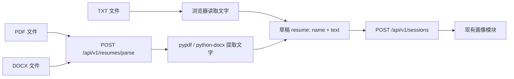

# 简历上传模块

支持 PDF、DOCX 和 UTF-8 TXT。文件内容先转换为现有 `{name, text}` 契约，再进入画像提取与会话流程。

## 数据流程



## 代码职责

| 模块 | 职责 |
| --- | --- |
| `web/src/lib/resume-client.ts` | 文件类型与大小检查、TXT 本地读取、PDF / DOCX multipart 上传、响应校验 |
| `web/src/components/profile/use-resume-upload.ts` | 解析状态、失败提示、请求取消与草稿写入 |
| `src/jobscout/api/resumes.py` | 接收上传、限制读取大小、在线程池执行解析、关闭上传文件 |
| `src/jobscout/services/resume_service.py` | PDF / DOCX / TXT 解析、文本归一化和错误分类 |

PDF 解析使用 `pypdf`，Word 解析使用 `python-docx`，提取段落、表格（含合并单元格和嵌套表格）及页眉页脚；HTTP 上传使用 `python-multipart`。

## 接口

`POST /api/v1/resumes/parse` 接收 `multipart/form-data`，必填字段 `file`。接口接受 PDF、DOCX 和 TXT，前端 TXT 默认在本地读取。

成功响应（HTTP 200）：

```json
{"name": "resume.pdf", "text": "Skills\nPython, SQL"}
```

失败响应示例（HTTP 422）：

```json
{"detail": {"code": "no_extractable_text", "message": "这份 PDF 没有可提取的文字，可能是扫描件；请先进行 OCR，或上传 DOCX / TXT 版本。"}}
```

不支持的格式返回 415；超过 10 MB 返回 413；空文件、编码错误、损坏或加密文件、无法提取文字、超过 100,000 字，以及 PDF 超过 50 页的文件返回 422。扩展名用于选择解析器，文件内容还需通过实际解析。Word 解压后最多 20 MB、最多 1,000 个 ZIP 条目，表格嵌套最多 10 层。

## 交互与留存

选择或拖入文件后立即解析。成功后写入草稿，上传区域显示文件名、文件图标和成功标记；悬停或键盘聚焦时切换为红色的“移除简历”及叉号。点击移除后恢复上传入口，再次点击选择文件。失败时显示具体原因并保留原有资料。解析期间禁止提交，表单卸载或移除简历时取消请求，旧响应不能覆盖新草稿。

TXT 在浏览器中读取，提交搜索时发送文字。PDF / DOCX 在选择时发送到本站后端提取文字，不调用外部解析服务，也不保存到业务文件存储；框架可能使用临时上传文件，处理结束后关闭。简历文字仍随会话状态进入现有 checkpoint。

图片扫描件需先 OCR 后再上传；复杂 PDF 排版的提取顺序取决于文件中的文字结构。

## 验证

后端测试覆盖真实多页 PDF、Word 中文段落与表格、页眉页脚、合并单元格与嵌套表格、TXT 编码和换行、损坏/加密/无文字文件、资源限制、multipart 接口及 PDF / DOCX 文字进入画像流程。前端测试覆盖本地 TXT、PDF / DOCX 请求、API 前缀、解析错误、响应校验及请求取消。
